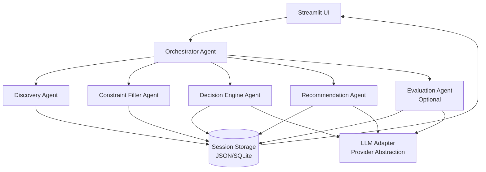
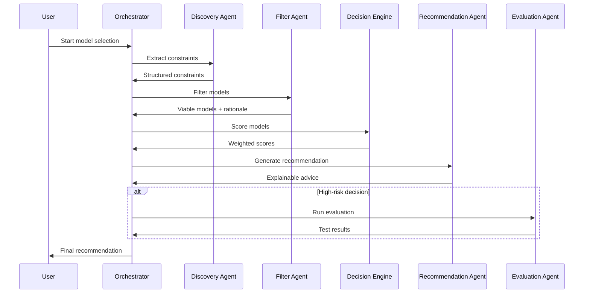

# Design Document: Context-Aware LLM Model Comparison & Decision Agent

## Overview

The Context-Aware LLM Model Comparison & Decision Agent is a multi-agent decision-support system that guides users through intelligent LLM model selection. Unlike generic comparison tools that rely on static benchmarks, this system extracts user constraints, eliminates incompatible options, performs weighted trade-off analysis, and provides explainable recommendations with mitigation strategies.

The system employs a sequential multi-agent architecture with five core agents plus one optional agent, orchestrated through explicit Python logic rather than heavy frameworks. The user interface is built with Streamlit as a guided, multi-step wizard that emphasizes decision clarity over dashboard complexity.

## Architecture

### High-Level Architecture



### Agent Flow Pattern

The system follows a **Sequential Handoff Pattern** with optional parallel evaluation:

1. **Discovery Phase**: Extract user constraints and priorities
2. **Filtering Phase**: Eliminate incompatible models with rationale
3. **Decision Phase**: Score remaining models using weighted criteria
4. **Recommendation Phase**: Generate explainable advice with trade-offs
5. **Evaluation Phase** (Optional): Conduct real-world testing when needed

### Data Flow



## Components and Interfaces

### 1. Orchestrator Agent

**Responsibility**: Central coordinator managing agent flow and session state

**Key Methods**:
- `process_request(user_input)` → Coordinates entire decision flow
- `route_to_agent(agent_type, data)` → Routes data between agents
- `maintain_session(session_id)` → Preserves state across interactions
- `handle_errors(error, context)` → Graceful error handling

**State Management**:
- Session context preservation
- Inter-agent data routing
- Error recovery and rollback
- Progress tracking

### 2. Discovery Agent

**Responsibility**: Extract user intent, constraints, and priorities

**Key Methods**:
- `extract_task_type(user_input)` → Identifies analytical/generative/agentic tasks
- `gather_constraints()` → Collects latency, budget, security requirements
- `infer_defaults(partial_constraints)` → Fills gaps with reasonable defaults
- `ask_clarifying_questions(missing_info)` → Minimal targeted questions
- `structure_output()` → JSON-formatted constraint specification

**Constraint Schema**:
```python
{
    "task_type": "analytical|generative|agentic",
    "latency_tolerance": "real-time|interactive|batch",
    "context_window": int,
    "security_requirements": ["compliance_type"],
    "budget_limits": {"max_cost_per_token": float, "monthly_budget": float},
    "traffic_expectations": {"requests_per_day": int, "peak_concurrent": int},
    "priorities": {"accuracy": float, "speed": float, "cost": float, "reliability": float}
}
```

### 3. Constraint Filter Agent

**Responsibility**: Eliminate incompatible models with clear rationale

**Key Methods**:
- `apply_hard_constraints(models, constraints)` → Filter by non-negotiable limits
- `record_elimination_reason(model, reason)` → Document why models were excluded
- `check_budget_compliance(model, budget)` → Cost threshold validation
- `validate_latency_requirements(model, sla)` → Performance validation
- `assess_context_capacity(model, requirements)` → Context window validation
- `evaluate_deployment_restrictions(model, constraints)` → Deployment compatibility

**Elimination Categories**:
- Budget ceiling exceeded
- Latency SLA not achievable
- Context window insufficient
- Security/compliance violations
- Deployment restrictions

### 4. Decision Engine Agent

**Responsibility**: Apply weighted scoring and compute trade-offs

**Key Methods**:
- `apply_dynamic_weights(criteria, user_priorities)` → Weight criteria by importance
- `score_reasoning_accuracy(model)` → Evaluate cognitive capabilities
- `measure_latency_performance(model)` → Assess response time characteristics
- `calculate_cost_efficiency(model, usage_pattern)` → Cost-benefit analysis
- `assess_reliability(model)` → Tool/API reliability evaluation
- `generate_relative_scores(models)` → Comparative rather than absolute scoring
- `explain_scoring_logic(model, scores)` → Transparent score rationale

**Scoring Dimensions**:
- Reasoning & Accuracy (benchmarks, domain-specific performance)
- Latency (response time, throughput)
- Cost Efficiency (token cost, operational overhead)
- Reliability (uptime, API stability, tool integration)
- Customization (fine-tuning, RAG compatibility)

### 5. Recommendation Agent

**Responsibility**: Convert analysis into human-readable advice

**Key Methods**:
- `generate_primary_recommendation(scored_models)` → Select best-fit option
- `identify_trade_offs(top_models)` → Explicit trade-off analysis
- `suggest_mitigation_strategies(weaknesses)` → Address identified risks
- `provide_future_proofing_advice()` → Multi-model routing, scaling strategies
- `format_explainable_output()` → Clear, contextual recommendations

**Output Structure**:
- Primary recommendation with confidence level
- Explicit trade-offs between top 2-3 options
- Mitigation strategies for identified weaknesses
- Future-proofing guidance (scaling, multi-model approaches)
- Decision rationale with supporting evidence

### 6. Evaluation Agent (Optional)

**Responsibility**: Real-world testing when decisions are close or high-risk

**Key Methods**:
- `recommend_evaluation_type(decision_context)` → Suggest appropriate tests
- `conduct_ab_testing(models, test_prompts)` → Comparative prompt testing
- `analyze_failure_cases(model, edge_cases)` → Robustness testing
- `validate_tool_integration(model, tools)` → Tool-calling accuracy
- `generate_evaluation_report(results)` → Comprehensive test summary

**Evaluation Types**:
- A/B prompt testing with domain-specific scenarios
- Failure case analysis (typos, ambiguous input, edge cases)
- Tool-calling accuracy validation
- Stress testing under load
- Domain-specific benchmark validation

## Data Models

### Session State Model

```python
class SessionState:
    session_id: str
    user_constraints: Dict[str, Any]
    eliminated_models: List[Dict[str, str]]  # model + reason
    viable_models: List[str]
    model_scores: Dict[str, Dict[str, float]]
    recommendation: Dict[str, Any]
    evaluation_results: Optional[Dict[str, Any]]
    current_step: str
    created_at: datetime
    updated_at: datetime
```

### Model Information Schema

```python
class ModelInfo:
    name: str
    provider: str
    context_window: int
    cost_per_token: Dict[str, float]  # input/output
    latency_characteristics: Dict[str, float]
    capabilities: List[str]
    deployment_options: List[str]
    benchmark_scores: Dict[str, float]
    reliability_metrics: Dict[str, float]
    last_updated: datetime
```

### Constraint Specification

```python
class UserConstraints:
    task_type: TaskType
    latency_requirements: LatencySpec
    context_needs: ContextSpec
    security_requirements: List[SecurityRequirement]
    budget_constraints: BudgetSpec
    traffic_expectations: TrafficSpec
    priority_weights: PriorityWeights
```

## LLM Integration Architecture

### Adapter Pattern Implementation

```python
class LLMAdapter:
    def __init__(self, provider: str):
        self.provider = provider
        self.client = self._initialize_client()
    
    def generate_response(self, prompt: str, **kwargs) -> str:
        # Standardized interface across providers
        pass
    
    def estimate_cost(self, prompt: str, max_tokens: int) -> float:
        # Provider-agnostic cost estimation
        pass
    
    def get_capabilities(self) -> Dict[str, Any]:
        # Standardized capability reporting
        pass
```

**Supported Providers** (via adapter):
- OpenAI (GPT-4, GPT-3.5)
- Anthropic (Claude)
- Google (Gemini)
- Local models (Ollama, vLLM)
- Azure OpenAI
- AWS Bedrock

### Cost Optimization Strategy

- **Minimal LLM Usage**: Use LLMs only for complex reasoning tasks
- **Efficient Prompting**: Structured prompts with clear output formats
- **Caching**: Cache model information and common constraint patterns
- **Batch Processing**: Group similar operations when possible

## Streamlit UI Architecture

### Multi-Step Wizard Design

The interface follows a guided wizard pattern with clear progress indication:

**Step 1: Use Case Definition**
- Task type selection (analytical/generative/agentic)
- Domain context (if relevant)
- High-level requirements gathering

**Step 2: Constraint & Priority Input**
- Latency requirements (real-time/interactive/batch)
- Budget constraints (cost per token, monthly limits)
- Security/compliance needs
- Traffic expectations
- Priority weighting (accuracy vs speed vs cost)

**Step 3: Model Filtering Results**
- Eliminated models with clear rationale
- Remaining viable options
- Constraint satisfaction summary

**Step 4: Trade-Off Comparison**
- Side-by-side model comparison
- Weighted scoring visualization
- Trade-off matrix showing strengths/weaknesses

**Step 5: Recommendation Summary**
- Primary recommendation with confidence
- Explicit trade-offs
- Mitigation strategies
- Future-proofing advice

**Step 6: Optional Evaluation**
- Evaluation recommendation
- Test configuration
- Results presentation

### State Management Pattern

```python
# Session state structure
if 'step' not in st.session_state:
    st.session_state.step = 1
    st.session_state.constraints = {}
    st.session_state.results = {}

# Step navigation
def next_step():
    st.session_state.step += 1

def previous_step():
    st.session_state.step -= 1

# Data persistence between steps
def save_step_data(step_name: str, data: Dict):
    st.session_state[step_name] = data
```

### UI Component Design

**Progress Indicator**:
- Visual step progression
- Completed/current/future step states
- Ability to navigate back to previous steps

**Constraint Input Forms**:
- Smart defaults with override capability
- Conditional fields based on previous selections
- Input validation with helpful error messages

**Comparison Visualizations**:
- Radar charts for multi-dimensional comparison
- Trade-off matrices highlighting key differences
- Cost-performance scatter plots

**Recommendation Display**:
- Clear primary recommendation with reasoning
- Expandable sections for detailed analysis
- Action buttons for next steps (evaluation, implementation)

## Correctness Properties

*A property is a characteristic or behavior that should hold true across all valid executions of a system—essentially, a formal statement about what the system should do. Properties serve as the bridge between human-readable specifications and machine-verifiable correctness guarantees.*

### Property Reflection

After analyzing all acceptance criteria, several properties can be consolidated to eliminate redundancy:

- **Discovery Agent properties** (1.1-1.9) can be grouped into input processing, constraint extraction, and output formatting properties
- **Constraint Filter properties** (2.1-2.7) can be consolidated into filtering logic and rationale tracking properties  
- **Decision Engine properties** (3.1-3.7) can be combined into scoring and explanation properties
- **UI properties** (7.1-7.5) are examples of specific interface behaviors rather than universal properties
- **State management properties** (8.1-8.5) can be consolidated into persistence and navigation properties

### Core Properties

**Property 1: Discovery Agent Constraint Extraction**
*For any* user input describing an LLM use case, the Discovery Agent should extract all relevant constraints (task type, latency, context window, security, budget, traffic) and produce valid JSON output matching the constraint schema
**Validates: Requirements 1.1, 1.2, 1.3, 1.4, 1.5, 1.6, 1.9**

**Property 2: Discovery Agent Smart Defaults**
*For any* incomplete constraint specification, the Discovery Agent should infer reasonable defaults for missing values without requiring user input when safe defaults exist
**Validates: Requirements 1.8**

**Property 3: Discovery Agent Minimal Questioning**
*For any* constraint extraction session, the Discovery Agent should ask clarifying questions only when required information is missing and no safe defaults exist
**Validates: Requirements 1.7**

**Property 4: Constraint Filter Elimination Logic**
*For any* set of models and constraints, the Constraint Filter Agent should eliminate all models that violate non-negotiable constraints (budget, latency, context window, deployment restrictions) and retain only viable options
**Validates: Requirements 2.1, 2.3, 2.4, 2.5, 2.6**

**Property 5: Constraint Filter Rationale Tracking**
*For any* eliminated model, the Constraint Filter Agent should record the specific constraint violation that caused elimination, ensuring complete traceability
**Validates: Requirements 2.2, 2.7**

**Property 6: Decision Engine Weighted Scoring**
*For any* set of viable models and user priorities, the Decision Engine Agent should apply dynamic weights to scoring criteria (reasoning, latency, cost, reliability) based on user-specified priorities
**Validates: Requirements 3.1, 3.2, 3.3, 3.4, 3.5**

**Property 7: Decision Engine Relative Scoring**
*For any* set of models being evaluated, the Decision Engine Agent should generate relative scores that enable comparison between models rather than absolute rankings
**Validates: Requirements 3.6**

**Property 8: Decision Engine Score Explanation**
*For any* model score generated, the Decision Engine Agent should provide transparent logic explaining how the score was calculated
**Validates: Requirements 3.7**

**Property 9: Evaluation Agent Conditional Testing**
*For any* decision scenario where model scores are close or stakes are high, the Evaluation Agent should recommend appropriate testing (A/B testing, failure analysis, tool integration checks)
**Validates: Requirements 4.1, 4.2, 4.3, 4.5**

**Property 10: Evaluation Agent Test Execution**
*For any* requested evaluation, the Evaluation Agent should execute the specified tests and provide comprehensive results
**Validates: Requirements 4.4**

**Property 11: Recommendation Agent Contextual Advice**
*For any* completed analysis, the Recommendation Agent should provide a primary recommendation with supporting context, explicit trade-offs, mitigation strategies, and future-proofing guidance
**Validates: Requirements 5.1, 5.2, 5.3, 5.4**

**Property 12: Recommendation Agent Reasoning Requirement**
*For any* recommendation generated, the Recommendation Agent should never state a preference without providing supporting context and reasoning
**Validates: Requirements 5.5**

**Property 13: Orchestrator Agent Flow Control**
*For any* user request, the Orchestrator should coordinate the sequential execution of Discovery, Constraint Filter, Decision Engine, and Recommendation agents, with optional Evaluation agent coordination
**Validates: Requirements 6.1, 6.2, 6.4**

**Property 14: Orchestrator State Preservation**
*For any* active session, the Orchestrator should preserve session context and intermediate results throughout the entire decision process
**Validates: Requirements 6.3**

**Property 15: Orchestrator Error Handling**
*For any* error that occurs during processing, the Orchestrator should handle failures gracefully and provide meaningful feedback rather than crashing
**Validates: Requirements 6.5**

**Property 16: System State Persistence**
*For any* user input or processing result, the system should store data in structured format (JSON/SQLite) and preserve state during navigation between UI steps
**Validates: Requirements 8.1, 8.2, 8.3, 8.4**

**Property 17: System History Preservation**
*For any* completed decision session, the system should optionally save decision history for future reference when requested
**Validates: Requirements 8.5**

**Property 18: LLM Adapter Standardization**
*For any* LLM provider integration, the system should route all calls through standardized adapter interfaces, enabling provider changes without code modifications
**Validates: Requirements 9.1, 9.2, 9.3**

**Property 19: LLM Adapter Extensibility**
*For any* new LLM provider, the system should support integration through adapter implementation without modifying existing code
**Validates: Requirements 9.4**

**Property 20: LLM Usage Optimization**
*For any* system operation requiring LLM calls, the system should minimize usage through efficient prompt design and caching to reduce costs
**Validates: Requirements 9.5**

## Error Handling

### Error Categories and Strategies

**1. User Input Errors**
- **Invalid Constraints**: Graceful validation with helpful error messages
- **Incomplete Information**: Smart defaults with user confirmation
- **Conflicting Requirements**: Clear explanation of conflicts with resolution options

**2. Agent Processing Errors**
- **Discovery Failures**: Fallback to manual constraint entry
- **Filtering Errors**: Conservative approach (include questionable models with warnings)
- **Scoring Failures**: Partial scoring with clear indication of missing data
- **Recommendation Errors**: Fallback to raw scoring data with user guidance

**3. External Service Errors**
- **LLM API Failures**: Retry logic with exponential backoff
- **Model Data Unavailable**: Use cached data with staleness warnings
- **Network Issues**: Offline mode with limited functionality

**4. System Errors**
- **State Corruption**: Session recovery with user notification
- **Storage Failures**: In-memory fallback with data loss warning
- **Configuration Errors**: Clear diagnostic messages with resolution steps

### Error Recovery Patterns

**Graceful Degradation**:
- Continue with partial functionality when possible
- Clear communication about limitations
- Offer alternative paths to completion

**User-Centric Error Messages**:
- Explain what went wrong in user terms
- Provide specific next steps
- Offer contact information for persistent issues

**State Recovery**:
- Automatic session restoration when possible
- Manual recovery options for corrupted state
- Progress preservation across error conditions

## Testing Strategy

### Dual Testing Approach

The system requires both unit testing and property-based testing to ensure comprehensive coverage:

**Unit Tests**: Verify specific examples, edge cases, and error conditions
- Agent integration points and data flow
- UI component behavior and state management
- Error handling scenarios and recovery mechanisms
- LLM adapter functionality with different providers

**Property Tests**: Verify universal properties across all inputs
- Constraint extraction accuracy across diverse user inputs
- Filtering logic consistency with various constraint combinations
- Scoring algorithm behavior with different model sets and priorities
- State preservation across navigation and error scenarios

### Property-Based Testing Configuration

**Testing Framework**: Hypothesis (Python property-based testing library)
- Minimum 100 iterations per property test for thorough coverage
- Custom generators for realistic user inputs, constraints, and model data
- Shrinking enabled to find minimal failing examples

**Test Organization**:
- Each correctness property implemented as a single property-based test
- Tests tagged with feature name and property reference
- Tag format: **Feature: llm-decision-agent, Property {number}: {property_text}**

### Testing Priorities

**High Priority (Core Logic)**:
1. Constraint extraction and validation (Properties 1-3)
2. Model filtering logic (Properties 4-5)
3. Scoring and recommendation generation (Properties 6-12)
4. Agent orchestration flow (Properties 13-15)

**Medium Priority (System Integration)**:
1. State management and persistence (Properties 16-17)
2. LLM adapter functionality (Properties 18-20)
3. Error handling and recovery mechanisms

**Lower Priority (UI and Polish)**:
1. Streamlit interface behavior
2. Visualization accuracy
3. Performance optimization

### Test Data Strategy

**Synthetic Data Generation**:
- Realistic user constraint scenarios across different domains
- Diverse model information with varying capabilities and costs
- Edge cases including extreme values and boundary conditions

**Real-World Validation**:
- Sample real user scenarios for integration testing
- Actual LLM provider responses for adapter testing
- Performance testing with realistic data volumes

### Continuous Testing

**Development Workflow**:
- Property tests run on every commit
- Integration tests run on pull requests
- Performance tests run nightly
- User acceptance testing before releases

**Monitoring and Alerting**:
- Property test failures trigger immediate alerts
- Performance regression detection
- Error rate monitoring in production
- User satisfaction tracking through feedback